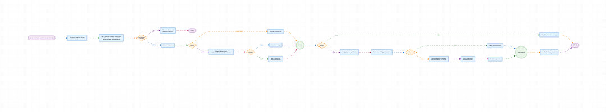

# mermaid-reactflow-render

Render [Mermaid](https://mermaid.js.org/) flowcharts as interactive
[React Flow](https://reactflow.dev/) diagrams. This is a **render-only** library
— it converts Mermaid `flowchart`/`graph` source into laid-out React Flow nodes
and edges and draws them. There is no editor.

The conversion approach and visual styling are inspired by and adapted from the
MIT-licensed [mermaid-reactflow-editor](https://github.com/albingcj/mermaid-reactflow-editor)
by albingcj — this package extracts and reimplements just the rendering half.



## Install

```bash
npm install mermaid-reactflow-render reactflow react react-dom
```

`reactflow`, `react`, and `react-dom` are **peer dependencies** — this library
is a React Flow plugin and intentionally shares the host app's single React
Flow instance rather than bundling its own. `@dagrejs/dagre` (used internally
for layout) ships as a regular dependency, so you don't need to install it.

## Usage

```tsx
import { MermaidFlow } from "mermaid-reactflow-render";
import "mermaid-reactflow-render/styles.css";

const code = `flowchart TD
  A([Start]) --> B{Decision?}
  B -->|Yes| C[Do the thing]
  B -->|No| D[Skip]
  C --> E((Done))
  D --> E`;

export default function App() {
  return (
    <div style={{ width: "100%", height: 600 }}>
      <MermaidFlow code={code} />
    </div>
  );
}
```

The component fills its parent, so give the wrapper an explicit size.

### Props

| Prop             | Type                  | Default | Description                                            |
| ---------------- | --------------------- | ------- | ------------------------------------------------------ |
| `code`           | `string`              | —       | Mermaid flowchart source.                              |
| `nodes` / `edges`| `Node[]` / `Edge[]`   | —       | Pre-computed elements (overrides `code`).              |
| `showControls`   | `boolean`             | `true`  | Bottom-left zoom / fit controls.                       |
| `showBackground` | `boolean`             | `true`  | Dotted background grid.                                |
| `direction`      | `"TB"｜"BT"｜"LR"｜"RL"` | —     | Force layout direction, overriding the source.         |
| `fitView`        | `boolean`             | `true`  | Fit the diagram to the viewport on mount.              |

### Horizontal vs. vertical layout

By default the layout follows the direction declared in the Mermaid source
(`flowchart TD`, `flowchart LR`, …). You can override it with the `direction`
prop — `"LR"`/`"RL"` lay the flow out **horizontally**, `"TB"`/`"BT"`
**vertically**:

```tsx
<MermaidFlow code={code} direction="LR" />
```

The same override is available on the converter: `convertMermaidToReactFlow(code, { direction: "LR" })`.

All other [React Flow props](https://reactflow.dev/api-reference/react-flow) are
forwarded.

### Converting without rendering

```ts
import { convertMermaidToReactFlow } from "mermaid-reactflow-render";

const { nodes, edges } = convertMermaidToReactFlow(code);
```

## Supported Mermaid syntax

- Directions: `TB` / `TD`, `BT`, `LR`, `RL`
- Node shapes: `[rect]`, `(round)`, `([stadium])`, `((circle))`, `{diamond}`
- Edge labels: `A -->|label| B` and `A -- label --> B`
- Edge styles: `-->`, `---`, `-.->`, `==>`
- Multi-line labels with `<br/>`
- Subgraphs (including nested) with per-subgraph `direction`

## Development

```bash
npm install
npm run dev          # playground at http://localhost:5180
npm test             # unit + component tests (vitest)
npm run test:e2e     # Playwright visual/e2e tests
npm run build        # build the publishable library into dist/
```

## License

MIT — see [LICENSE](./LICENSE). Includes attribution to the original
mermaid-reactflow-editor project.
